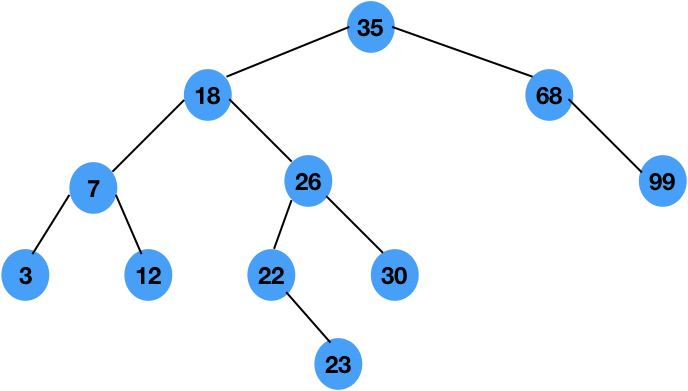

## Tree?

트리 구조는 계층적이며, 갯수의 제한이 없다.

하지만 데이터 접근 속도에서 array 보다는 느리며, 선형 리스트보다는 빠르다.

데이터의 삽입 삭제가 array 보다 편하고, 선형 리스트 보다는 불편하다.

## Tree의 중요 기능

1. 계층적 데이터를 다룸.

2. 만들어진 정보에 대한 검색(tree traversal)이 편함.

3. 데이터를 정렬할수 있음.

4. 데이터에 대한 삽입과 삭제가 자유로움.


## Binary tree(이진트리)

> 자식 노드를 최대 2개 까지 갖고 있는 tree를 binary tree(이진 트리)라고 한다.
> 각 노드가 오로지 2개의 자식노드를 갖기 때문에 자식 노드는  left and right child 두종류이다.

### Signature of Binary tree

1. 단일 노드로 시작하며, 시작 노드를 root 라고 한다. 

2. 모든 노드는 최대 2개의 자식 노드를 가질수 있다.
3. 루트 노드를 기준으로 왼쪽 하위 트리(Left subtree)의 값은 전부 루트 보다 작다.
4. 루트 노드를 기준으로 오른쪽 하위 트리(Right subtree)의 값은 전부 크다.
5. 각 노드의 왼쪽 자식노드(Left child)는 해당 노드 보다 작고,
    오른쪽 자식 노드(Right child) 는 크다
6. childern node가 없는 노드는 External/Leaf node 를 갖고 값은 NULL이다.


### Terms of Binary tree

```c
        8   L-1
    5      12  L-2
  3   6  10   15 L-3
2 					L-4
```
* Node

    각 요소들을 Node라 칭한다.

    

* Root

    단일 노드로 시작 하는 가장 상위 노드.

    ex) 8이 루트 노드이다.

    

* Ancestor(조상)

    u에서 v로 가는 경로 중에 u가 v보다 root에 가깝 다면

    u를 v의 Ancestor라고 한다.

    3의 ancestor는 5,8 두개이다.

    

* Descendant(후손)

    Ancestor관계 에서 v를 u의 Descendant라고 한다.

    ex)2는 3,5,8의 descendant이다.

    

* Internal node

    값을 갖고 있는 노드.

    

* Exteral/Leaf node

    자식 노드가 없으며, 값이 NULL인 노드.

    

* Parent

    v가 u의 직계 하위 노드 일때, u를 v의 parent 노드라 한다.

    

* Children

    위의 관계에서 v는 children 노드라 한다.

    children노드는 left, right 두개의 자시노드가 존재 할수있다.

    

* Sibling(형제)

    parent가 같은 두 노드의 관계를 형제 노드라 한다.

    

* Edge(연결선)

    노드와 노드 사이의 연결을 Edge라 한다.

    

* Path(경로)

    후손 노드를 가진 u에서 v까지의 경로

    

* Degree(차수)

    해당 노드가 보유한 children 의 수(leaf node 제외).

    단, leaf node의 차수는 0.

    

* Level

    root에서 자신이 있는 노드 까지의 경로 길이 +1 이라 정의함.

    단, root의 level=1이다.

    ex) 3 의 Level 은 3이다.

    

* Depth

    p의 depth는 p자신을 제외한 ancestor의 갯수이다.

    단, root의 depth=0이다.

    ex) 2의 depth는 ancestor 3,5,8 3개인 3이다.

    

* Height

    각 위치에서의 최대 깊이가 높이가 된다. 위의 depth랑 다른 개념.

    단, 해당 노드는 반드시 leaf노드를 갖고 있어야 한다.

    ex) 만약 싱글 루트 이면 높이는 1이다.

    다시 말해, 루트 노드 에서 가장 깊이 있는 leaf 까지의 edge의 갯수이다.

    루트 자신의 높이는 1이다.

    즉, 최대 Level의 값이 높이가 된다.

## Implementation of Binary tree

> 중복 값은 없고, 자연수 범위의 숫자를 가정한다.
>
> 이미 정렬된 트리에서 새로 들어온 값에 의해 재정렬은 안한다는 전제 조건.

### Insertion

1. root노드가 없다면 root노드 생성
2. 루트 노드가 존재하고, 각 서브트리에서 작으면 왼쪽, 크면 오른쪽으로 순회하면 해당 위치에 삽입.

  


### Deletion

> 삭제 알고리즘은 3가지 경우를 고려해야 한다. 단일 노드 일 경우, 한개의 서브트리를 가진경우
>
> 두개의 서브트리를 가진 경우 이다.


1. 단일 노드인경우

   단일 노드의 경우 해당 노드의 부모노드에서 해당 노드의 경로에 NULL을 주고 해당 노드를 free해주면된다.

   

2. 한개의 서브트리를 가진 경우

   삭제 하려는 노드가 한개의 서브트리만 가진경우, 삭제 하려는 노드의 다음 노드를 삭제 하려는 노드

   의 부모가 가르키게끔 해주고 삭제 하려는 노드 free.

   

3. 두개의 서브트리를 가진경우

   가장 복잡한 경우이다. 하지만 걱정 할거 없다.

   경우의 수는 총 두가지 인데, 삭제 노드의 왼쪽 서브트리에서 right most를 가져 오던가,

   오른쪽 서브트리에서 left most를 가져오면 된다.

   하지만 우리는 left most의 방식을 채택하겠다.

   왜냐면 각 서브 트리에서 right most와 left most는 해당 삭제 노드의 선행자 혹은 후행자일수 있다.

   다음 구조를 참조해보자.

   

   우리는 18을 지우려 한다.

   그럼 18을 지우고 어떤 값을 넣어야 트리 구조에 최소한의 영향을 끼칠지 생각해야 한다.

   

   우선 Inorder traversal 을 생각해 보자.

   18에 도달하기 이전에 12(선행자)을 탐색할테고, 그 후엔 22(후행자)를 탐색할 것이다.

   하지만 문제가 있다 선행자 12 를 삭제 노드로 올리면 문제 없지만 후행자 22를 올리면

   23이 갈곳을 잃게 된다.

   그렇다고 해서 매번 Depth를 새로 탐색해서 left most, right most를 결정하는것은

   Big-O시간이 증가 해버린다.


​	다시 잘생각해 보자. 오른쪽 서브트리에서 left most를 찾을때 만약 가장 왼쪽 제일 밑의

​	left most가 존재 한다면 아무런 문제가 없을것이다. 그러나 left most에 right child가 

​	존재 하는 경우가 있을것이다. 걱정 할것 없다 어차피 left most를 찾을때 발생하는 경우는

​	이 두가지 뿐이다.

​	Left most가 children이 없을때, Right child가 존재 할때.

​	그럼 단순히 조건문에서 children을 검색후 존재 한다면 left most를 삭제 노드에 올린후

​	child를 left most자리에 놓아주면 끝이다.